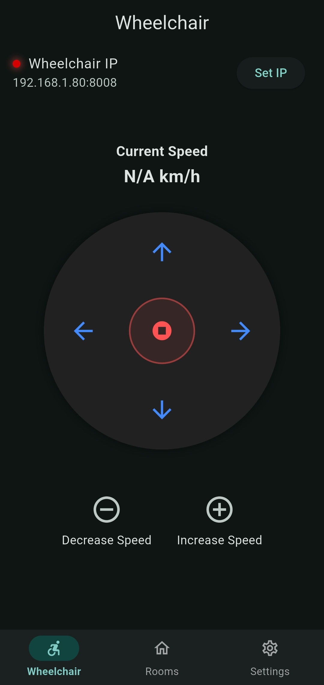
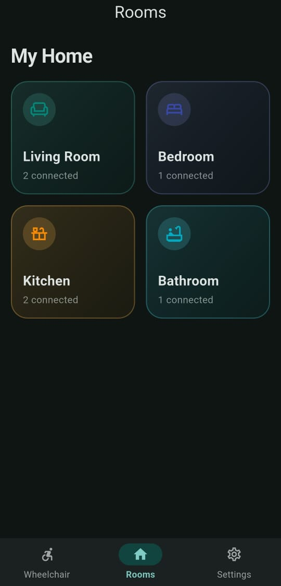
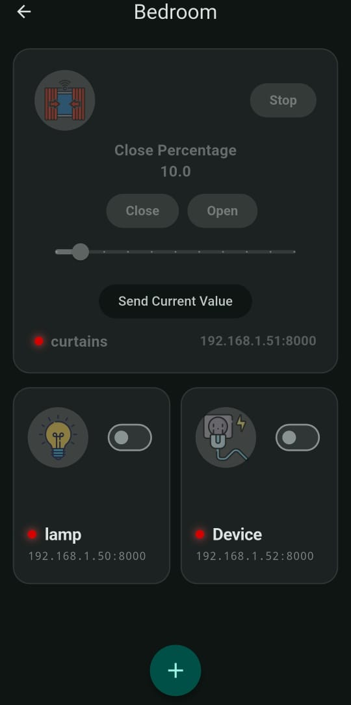

# Smart Wheelchair & Smart Home Control Application

## Overview

This Flutter application serves as a centralized control platform for both a Smart Wheelchair System and a Smart Home Automation System. The application enables real-time monitoring and control of multiple ESP-based devices through UDP communication while maintaining responsive user interaction using reactive state management.

---
## Application User Interface

The Flutter application provides a centralized interface for controlling both the Smart Wheelchair and Smart Home devices.

### Main Screens

#### Wheelchair Control Screen

* Real-time wheelchair navigation controls.
* Forward, Backward, Left, Right movement commands.
* Speed increase and decrease controls.
* Live speed feedback from the wheelchair controller.

#### Smart Home Dashboard

* Room-based organization of connected devices.
* Quick access to device status and controls.
* Real-time online/offline indicators.

#### Device Management Screen

* Add, edit, and remove devices.
* Configure device name, IP address, port, and type.
* Support for multiple smart device categories.

### User Interface Features

* Responsive Flutter-based design.
* Real-time state synchronization.
* Reactive updates using ValueNotifier.
* Swipe-to-refresh device status updates.
* Automatic visual feedback for device state changes.
* Online/offline status indicators.

### Screenshots

## Application User Interface

### Wheelchair Control Screen

### Smart Home Dashboard

### Device Cards

## Features

### Smart Wheelchair Control

* Forward, Backward, Left, and Right movement control.
* Speed increase and decrease commands.
* Real-time wheelchair speed monitoring.
* Dead-Man's Switch safety mechanism.
* Low-latency UDP communication.

### Smart Home Management

* Device organization by rooms.
* Dynamic device provisioning.
* Support for multiple device categories:

  * Relay Nodes
  * Hybrid Relay Nodes
  * Motorized Curtains
  * Environmental Sensors
  * Door Contact Sensors
  * PIR Motion Sensors

### Real-Time Synchronization

* Automatic device state synchronization.
* Broadcast-based device discovery.
* Reactive UI updates using ValueNotifier.
* Bidirectional communication between hardware and mobile application.

### Reliability Features

* Device watchdog monitoring.
* Sensor watchdog monitoring.
* Automatic offline detection.
* Network recovery mechanisms.
* Dynamic subnet migration support.

### Data Persistence

* Device configuration storage using SharedPreferences.
* Automatic restoration of saved devices.
* Persistent room and device settings.

---

## Communication Architecture

### Wheelchair Communication

Application → Wheelchair Controller

* Protocol: UDP
* Target IP: Configurable
* Command Port: 8007

Supported Commands:

| Command | Description    |
| ------- | -------------- |
| F       | Forward        |
| B       | Backward       |
| L       | Left           |
| R       | Right          |
| S       | Stop           |
| I       | Increase Speed |
| D       | Decrease Speed |

Wheelchair → Application

* Telemetry Port: 5003
* Returns current speed and status information.

---

### Smart Home Communication

The application communicates with ESP devices using UDP broadcast and direct messages.

Common Broadcast Requests:

| Request          | Purpose                            |
| ---------------- | ---------------------------------- |
| full_stats       | Retrieve relay and curtain states  |
| send_sensor_data | Retrieve environmental sensor data |
| door_data        | Retrieve door sensor status        |
| pir_data         | Retrieve motion sensor status      |

---

## Software Architecture

The application follows a reactive architecture:

UDP Listener
→ JSON Parsing
→ State Management
→ ValueNotifier Updates
→ Targeted UI Refresh

Only affected widgets are rebuilt, improving performance and reducing unnecessary rendering operations.

---

## Watchdog Mechanisms

### Device Watchdog

* Relay devices: 5-second timeout.
* Curtain devices: 10-second timeout.
* Automatically marks devices as offline when no response is received.

### Sensor Watchdog

* Starts after receiving the first sensor packet.
* Resets on every new sensor update.
* Requests new sensor data if no update is received within 5 seconds.

---

## Network Monitoring

The application continuously monitors network connectivity.

When a network change is detected:

1. All UDP sockets are closed.
2. Active listeners are restarted.
3. Device states are temporarily reset.
4. Subnet information is updated.
5. State synchronization broadcasts are reissued.
6. Device communication is automatically restored.

---

## Technologies Used

* Flutter
* Dart
* UDP Networking
* ESP32
* ValueNotifier State Management
* SharedPreferences
* JSON Serialization

---

## Future Improvements

* Secure communication layer.
* User authentication system.
* Cloud synchronization.
* Device grouping and scenes.
* Advanced analytics dashboard.

---

## Author

Graduation Project – Computer Engineering

Smart Wheelchair and Smart Home Integration Platform
